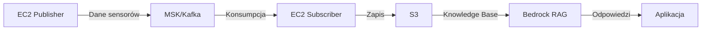
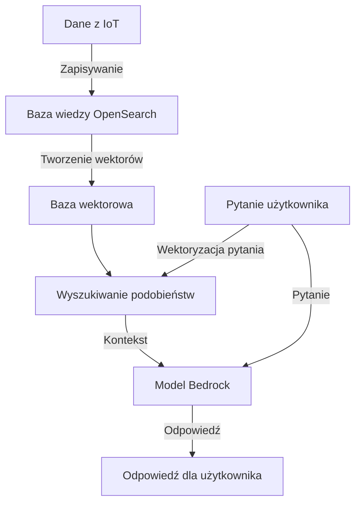

# IoT Data Analysis Platform

Temat projektu:
Automatyzacja infrastruktury dla analizy danych z IoT z użyciem AWS CDK, AWS IoT Core, Amazon MSK (kafka) oraz integracji z systemem RAG.

## Opis projektu

Projekt zakłada automatyzację wdrożenia infrastruktury w modelu Infrastructure as Code (IaC) na platformie AWS za pomocą AWS CDK w Python.

### Cele projektu:
1. Automatyzacja wdrażania infrastruktury chmurowej przy użyciu AWS CDK w Python
2. Przetwarzanie danych z IoT za pomocą AWS IoT Core
3. Strumieniowe przesyłanie danych przy użyciu Amazon MSK
4. Integracja z zewnętrznym systemem RAG (np. do analizy danych lub wizualizacji wyników). Np LM Studio

### Infrastruktura obejmuje:
1. Dwie instancje EC2 na AWS Cloud
2. Usługi AWS:
   - AWS IoT Core do odbierania danych z urządzeń IoT oraz przetwarzania wstępnego
   - Amazon MSK (Managed Streaming for Apache Kafka) do strumieniowego przesyłania danych
3. System RAG zaimplementowany przy użyciu:
   - Amazon Bedrock jako model językowy
   - Amazon Knowledge Base do przechowywania i wyszukiwania wiedzy
4. Wizualizacja i analiza danych:
   - Amazon OpenSearch Service
   - OpenSearch Dashboards


## Wymagania wstępne

### 1. AWS CLI

Instalacja na Linux:
```bash
curl "https://awscli.amazonaws.com/awscli-exe-linux-x86_64.zip" -o "awscliv2.zip"
unzip awscliv2.zip
sudo ./aws/install
```

Instalacja na Windows:
- instalator: https://aws.amazon.com/cli/

Konfiguracja:
```bash
aws configure
```
Dane w pliku:
- AWS Access Key ID
- AWS Secret Access Key
- Default region: eu-central-1
- Default output format: json

### 2. pyenv

Instalacja na Linux:
```bash
curl https://pyenv.run | bash

# Dodanie do ~/.bashrc lub ~/.zshrc:
export PATH="$HOME/.pyenv/bin:$PATH"
eval "$(pyenv init -)"
eval "$(pyenv virtualenv-init -)"
```

Instalacja na Windows:
```bash
#PowerShell
Invoke-WebRequest -UseBasicParsing -Uri "https://raw.githubusercontent.com/pyenv-win/pyenv-win/master/pyenv-win/install-pyenv-win.ps1" -OutFile "./install-pyenv-win.ps1"; &"./install-pyenv-win.ps1"
```

### 3. Poetry

Instalacja na Windows (PowerShell):
```bash
(Invoke-WebRequest -Uri https://install.python-poetry.org -UseBasicParsing).Content | py -
```

### 4. AWS CDK

Instalacja (wymaga Node.js):
```bash
npm install -g aws-cdk
```

## Struktura projektu

```
.
├── README.md                 # Dokumentacja projektu
├── pyproject.toml           # Konfiguracja Poetry i zależności
├── poetry.lock              # Lock file dla zależności
├── .python-version          # Wersja Pythona (pyenv)
├── cdk/                     # Kod infrastruktury
│   ├── app.py              # Główny plik CDK - definicja stacków
│   └── stacks/             # Stacki CDK
│       ├── __init__.py
│       ├── vpc_stack.py    # Stack VPC (sieć)
│       ├── ec2_stack.py    # Stack EC2 (maszyny wirtualne)
│       ├── iot_stack.py    # Stack IoT Core (obsługa IoT)
│       ├── msk_stack.py    # Stack MSK (Kafka)
│       ├── opensearch_stack.py  # Stack OpenSearch (wizualizacja)
│       └── bedrock_stack.py    # Stack Bedrock (RAG)
├── iot/                     # Kod dla IoT
│   ├── publisher/          # Kod publishera
│   │   └── main.py        # Publisher IoT
│   └── subscriber/         # Kod subscribera
│       └── main.py        # Subscriber IoT
├── knowledge_base/          # Konfiguracja Knowledge Base
└── docs/                    # Dodatkowa dokumentacja
```

## Architektura

### Komponenty:
1. **EC2 Publisher**
   - Symuluje dane sensorów (temperatura, wilgotność, ciśnienie)
   - Wysyła dane bezpośrednio do MSK
   - Generuje realistyczne scenariusze testowe

2. **Amazon MSK**
   - Kolejkuje i zarządza strumieniem danych
   - Zapewnia niezawodność i skalowalność
   - Punkt integracji między komponentami

3. **EC2 Subscriber**
   - Odbiera dane z MSK
   - Przetwarza i transformuje dane
   - Zapisuje do OpenSearch

4. **OpenSearch**
   - Przechowuje i indeksuje dane
   - Umożliwia wizualizację i analizę
   - Tworzenie dashboardów

### Przepływ danych:

Obecnie:


### Architektura RAG (Retrieval Augmented Generation):


## Komponenty systemu
### Node-RED vs Rozwiązanie natywne

#### Faza 1 (Podstawowa):
- **EC2 Publisher**:
  * Bezpośrednie wysyłanie danych do MSK
  * Symulacja odczytów sensorów
  * Prosty setup i debugowanie
- **MSK**:
  * Kolejkowanie i buforowanie danych
  * Niezawodna komunikacja
- **EC2 Subscriber**:
  * Odbiór danych z MSK
  * Przetwarzanie i zapis do OpenSearch

Początkowo planowane było użycie Node-RED do:
- Odbierania danych z urządzeń IoT
- Wstępnego przetwarzania danych


Zamiast tego użyto:

**Publisher EC2**:
- Symulacja urządzeń IoT
- Standaryzacja formatu danych
- Bezpośrednie wysyłanie do MSK

**Subscriber EC2**:
- Odbiór danych z MSK
- Przetwarzanie i transformacja
- Zapis do bazy danych

Zalety tego podejścia:
- Mniejsza złożoność (brak dodatkowego komponentu)
- Lepsze możliwości skalowania
- Natywna integracja z AWS
- Łatwiejsze monitorowanie i debugowanie

### Publisher (EC2)
- Symulacja urządzeń IoT
- Standaryzacja formatu danych
- Bezpośrednie wysyłanie do MSK

### Subscriber (EC2)
- Odbiór danych z MSK
- Przetwarzanie i transformacja
- Zapis do pliku/bazy danych

### Format danych
```json
{
  "device_id": "rpi5_001",
  "timestamp": "2025-02-20T12:00:00Z",
  "sensors": {
    "temperature": 25.6,
    "humidity": 45.2,
    "pressure": 1013.25,
    "orientation": {
      "pitch": 0.5,
      "roll": -0.3,
      "yaw": 90.0
    }
  }
}
```

## Instalacja i wdrożenie

1. Tworzenie wymaganych secretów:
```bash
# sekrety dla IoT Core -> MSK SSL
aws secretsmanager create-secret \
    --name iot/keystore \
    --description "SSL keystore for IoT Core -> MSK connection" \
    --secret-string "dummy-keystore-value"

aws secretsmanager create-secret \
    --name iot/keystore_password \
    --description "SSL keystore password for IoT Core -> MSK connection" \
    --secret-string "dummy-password"
```

2. Wdrożenie stacków:
```bash
# Wdrożenie wszystkich stacków
cdk deploy --all --require-approval never

# Lub wdrożenie pojedynczego stacka
cdk deploy VPCStack
cdk deploy MSKStack
cdk deploy CoreStack
cdk deploy SearchStack
cdk deploy BedrockStack
cdk deploy EC2Stack
```

3. Połączenie z instancjami EC2:

Po wdrożeniu stacków, aby połączyć się z instancjami EC2:

### a) Pobranie i konfiguracja klucza SSH
```bash
# Należy skopiować komendę z outputu  EC2Stack.SSHKeyCommand lub użyć:
aws ec2 describe-key-pairs --key-pair-ids <key_pair_id> --query 'KeyPairs[0].KeyMaterial' --output text > iot-ec2-key.pem
chmod 400 iot-ec2-key.pem
```

### b) Połączenie z instancjami
```bash
# Połączenie z Publisher EC2 (adres z outputu EC2Stack.PublisherPublicIP)
ssh -i iot-ec2-key.pem ec2-user@<publisher-public-dns>
# np. ssh -i iot-ec2-key.pem ec2-user@ec2-3-67-71-25.eu-central-1.compute.amazonaws.com

# Połączenie z Subscriber EC2 (adres z outputu EC2Stack.SubscriberPublicIP)
ssh -i iot-ec2-key.pem ec2-user@<subscriber-public-dns>
# np. ssh -i iot-ec2-key.pem ec2-user@ec2-18-194-156-205.eu-central-1.compute.amazonaws.com
```

### c) Sprawdzanie logów aplikacji
(Po połączeniu z instancją)
```bash
# Logi publishera
sudo journalctl -u iot-publisher -f

# Logi subscribera
sudo journalctl -u iot-subscriber -f
```

### d) Alternatywne metody połączenia
1. AWS Systems Manager Session Manager (nie wymaga otwartego portu 22):
```bash
aws ssm start-session --target <instance-id>
```

2. EC2 Instance Connect przez konsolę AWS:
   - konsola AWS EC2
   - instancję
   - "Connect"
   - "EC2 Instance Connect"
   - "Connect"

## Monitorowanie i debugowanie
### Logowanie

```bash
# Sprawdź logi w czasie rzeczywistym
sudo journalctl -u iot-publisher -f
sudo journalctl -u iot-subscriber -f

# Filtruj po poziomie logowania
sudo journalctl -u iot-publisher -p err  # tylko błędy
sudo journalctl -u iot-publisher -p info # info i wyżej

# Logi z ostatnich X minut
sudo journalctl -u iot-publisher --since "10 minutes ago"

# Logi są też zapisywane do plików
sudo tail -f /var/log/iot-publisher.log
sudo tail -f /var/log/iot-subscriber.log
```

Struktura logów:
```
2025-02-24 14:08:44 - INFO - Received data: {
  "device_id": "rpi5_001",
  "timestamp": "2025-02-24T14:08:44.757457Z",
  "sensors": {
    "temperature": 20.9,
    "humidity": 43.0
  }
}
```

## Weryfikacja działania

### 1. Połączenie z instancjami

1. Instalacja pluginu Session Manager:
```bash
# Na Linux/macOS
curl "https://s3.amazonaws.com/session-manager-downloads/plugin/latest/ubuntu_64bit/session-manager-plugin.deb" -o "session-manager-plugin.deb"
sudo dpkg -i session-manager-plugin.deb


# Na Windows - przez PowerShell
Invoke-WebRequest https://s3.amazonaws.com/session-manager-downloads/plugin/latest/windows/SessionManagerPluginSetup.exe -OutFile SessionManagerPluginSetup.exe
.\SessionManagerPluginSetup.exe
```

2. Łączenie się z instancjami (komendy z outputów stacka):
```bash
# Połączenie z Publisher (z sudo i bash)
aws ssm start-session \
  --target $(aws cloudformation describe-stacks --stack-name EC2Stack --query 'Stacks[0].Outputs[?OutputKey==`PublisherInstanceId`].OutputValue' --output text) \
  --document-name AWS-StartInteractiveCommand \
  --parameters command="sudo -i"

# Połączenie z Subscriber (z sudo i bash)
aws ssm start-session \
  --target $(aws cloudformation describe-stacks --stack-name EC2Stack --query 'Stacks[0].Outputs[?OutputKey==`SubscriberInstanceId`].OutputValue' --output text) \
  --document-name AWS-StartInteractiveCommand \
  --parameters command="sudo -i"
```

Po połączeniu będzie pełny dostęp do systemctl i innych narzędzi systemowych.

### 2. Sprawdzenie procesów

Po połączeniu z instancjami:

1. status serwisów:
```bash
# Na Publisher:
systemctl status iot-publisher

# Na Subscriber:
systemctl status iot-subscriber
```

2. logi w czasie rzeczywistym:
```bash
# Na Publisher:
journalctl -u iot-publisher -f

# Na Subscriber:
journalctl -u iot-subscriber -f
```

3. W razie potrzeby moożna zrestartować serwisy:
```bash
# Restart serwisów
systemctl restart iot-publisher
systemctl restart iot-subscriber

# Włącz serwisy
systemctl enable iot-publisher
systemctl enable iot-subscriber
```

### 3. Weryfikacja przepływu danych

1. instalcja narzędzia Kafka:
```bash
sudo yum install -y java-11 kafka
```

2. Konfiguracja połączenia z MSK:
```bash
export MSK_BROKERS=$(aws kafka get-bootstrap-brokers \
  --cluster-arn $(aws kafka list-clusters \
  --query 'ClusterInfoList[?ClusterName==`msk-mskstack`].ClusterArn' \
  --output text) --query 'BootstrapBrokerStringTls' --output text)
```

3. dane w Kafka:
```bash
kafka-console-consumer.sh \
  --bootstrap-server $MSK_BROKERS \
  --topic iot-data \
  --from-beginning
```

Output:
```json
{
  "device_id": "sim_001",
  "timestamp": "2024-02-23T15:30:00Z",
  "sensors": {
    "temperature": 25.6,
    "humidity": 45.2,
    "pressure": 1013.25
  }
}
```

4. weryfikacja czy dane przepływają przez system:
```bash
# nazwę bucketa
BUCKET_NAME=$(aws cloudformation describe-stacks --stack-name S3Stack --query 'Stacks[0].Outputs[?OutputKey==`BucketName`].OutputValue' --output text)

# zawartość bucketa
aws s3 ls s3://$BUCKET_NAME/raw-data/ --recursive

# przykładowy plik z danymi
aws s3 cp s3://$BUCKET_NAME/raw-data/$(date +%Y/%m/%d)/<wybierz-plik> - | jq
```

> **Note**: Dane są organizowane w folderach według daty (YYYY/MM/DD/HH/MM_SS.json)

5. Używanie RAG do analizy danych:
- konsola AWS
- usługa Bedrock
- "Playground"
- W sekcji "Knowledge base" należy "IoTSensorsKB" (utworzona automatycznie przez CDK)

- Po utworzeniu knowledge base można:
  1. Zadawać pytania bezpośrednio w Playground
  2. Używać API przez AWS SDK
  3. Monitorować wykorzystanie w zakładce "Metrics"

Przykładowe pytania:
- "Jaka była średnia temperatura w ciągu ostatniej godziny?"
- "Czy występowały jakieś anomalie w odczytach wilgotności?"
- "Pokaż trendy ciśnienia atmosferycznego z ostatnich 24 godzin"
- "Jakie są korelacje między temperaturą a wilgotnością?"
- "W jakich godzinach występują największe wahania ciśnienia?"

> **Note**: Pierwsze odpowiedzi mogą zająć kilka minut, ponieważ Bedrock musi zaindeksować dane

### 4. Rozwiązywanie problemów

Jeśli coś nie działa:

1. logi błędów:
```bash
sudo journalctl -u iot-publisher -p err
sudo journalctl -u iot-subscriber -p err
```

2. restart serwisów jeśli potrzeba:
```bash
sudo systemctl restart iot-publisher
sudo systemctl restart iot-subscriber
```

3. połączenie z MSK:
```bash
# Powinno pokazać listę brokerów
echo $MSK_BROKERS
```


## Uruchomienie projektu

### 1. Rozwój i testowanie lokalne
1. Instalacja zależności:
```bash
poetry install
poetry shell
```

2. Wdrożenie infrastruktury testowej:
```bash
cd cdk
cdk deploy --all
```

### Konfiguracja symulatora:

#### Tryby działania:
1. **Podstawowy (MSK)**:
   - Bezpośrednie publikowanie do Kafki
   - Domyślny tryb dla fazy testowej
   - Prostsza konfiguracja i debugowanie

2. **Rozszerzony (IoT Core)**:
   - Publikowanie przez MQTT do IoT Core
   - Przygotowany do integracji z Raspberry Pi
   - Pełne wsparcie dla urządzeń IoT

#### Harmonogram działania:
- Symulator uruchamia się co godzinę
- Działa przez 5 minut
- Wysyła dane co 60 sekund
- Można dostosować przez zmienne:
  * SIMULATION_DURATION_MINUTES
  * SIMULATION_INTERVAL

#### Integracja z Raspberry Pi:
1. **Przygotowanie**:
   ```bash
   # Na Raspberry Pi
   git clone <repo>
   cd <repo>
   pip install poetry
   poetry install
   ```

2. **Konfiguracja**:
   ```bash
   # należy skopiować .env z EC2
   scp ec2-user@<ec2-ip>:/opt/iot-app/iot/.env ./iot/.env
   ```

3. **Uruchomienie**:
```bash
   poetry run python iot/publisher/main.py
   ```

4. **Automatyzacja**:
```bash
   # Dodanie do crontab
   crontab -e
   0 * * * * cd /path/to/app && poetry run python iot/publisher/main.py
   ```


1. **Faza testów**:
```bash
   # W cdk/app.py należy zmienić:
   DEPLOY_OPENSEARCH = True
   ```
   - Włączyć na czas testowania wizualizacji
   - Wyłączyć po zakończeniu testów
   - Użyć `cdk destroy` aby uniknąć niepotrzebnych kosztów

2. **Produkcja**:
   - można włączyć gdy potrzeba:
     * Długoterminowego przechowywania danych
     * Zaawansowanej analizy i wizualizacji
     * Integracji z systemem RAG


#### Alternatywy dla fazy rozwojowej:
1. **Lokalna baza danych**:
   - SQLite lub PostgreSQL na EC2
   - Elasticsearch w kontenerze Docker
   - Własny system logowania

2. **Tymczasowe rozwiązania AWS**:
   - CloudWatch Logs do przechowywania danych
   - S3 do archiwizacji
   - DynamoDB

## Weryfikacja działania

### 1. Połączenie z instancjami (Session Manager)

1. Instalacja plugin Session Manager:
```bash
# Na Linux/macOS
curl "https://s3.amazonaws.com/session-manager-downloads/plugin/latest/ubuntu_64bit/session-manager-plugin.deb" -o "session-manager-plugin.deb"
sudo dpkg -i session-manager-plugin.deb

# Na Windows - przez PowerShell
Invoke-WebRequest https://s3.amazonaws.com/session-manager-downloads/plugin/latest/windows/SessionManagerPluginSetup.exe -OutFile SessionManagerPluginSetup.exe
.\SessionManagerPluginSetup.exe
```

2. Połączenie się z instancjami (użyj komend z outputów stacka):
```bash
# Połączenie z Publisher (z sudo i bash)
aws ssm start-session \
  --target $(aws cloudformation describe-stacks --stack-name EC2Stack --query 'Stacks[0].Outputs[?OutputKey==`PublisherInstanceId`].OutputValue' --output text) \
  --document-name AWS-StartInteractiveCommand \
  --parameters command="sudo -i"

# Połączenie z Subscriber (z sudo i bash)
aws ssm start-session \
  --target $(aws cloudformation describe-stacks --stack-name EC2Stack --query 'Stacks[0].Outputs[?OutputKey==`SubscriberInstanceId`].OutputValue' --output text) \
  --document-name AWS-StartInteractiveCommand \
  --parameters command="sudo -i"
```


### 2. Sprawdzenie procesów

Po połączeniu z instancjami:

1. Sprawdzenie statusów serwisów:
```bash
# Na Publisher:
systemctl status iot-publisher

# Na Subscriber:
systemctl status iot-subscriber
```

2. logi w czasie rzeczywistym:
```bash
# Na Publisher:
journalctl -u iot-publisher -f

# Na Subscriber:
journalctl -u iot-subscriber -f
```


### 3. Weryfikacja przepływu danych

1. instalacja Kafka:
```bash
sudo yum install -y java-11 kafka
```

2. połączenie z MSK:
```bash
export MSK_BROKERS=$(aws kafka get-bootstrap-brokers \
  --cluster-arn $(aws kafka list-clusters \
  --query 'ClusterInfoList[?ClusterName==`msk-mskstack`].ClusterArn' \
  --output text) --query 'BootstrapBrokerStringTls' --output text)
```

3. dane w Kafka:
```bash
kafka-console-consumer.sh \
  --bootstrap-server $MSK_BROKERS \
  --topic iot-data \
  --from-beginning
```

Output:
```json
{
  "device_id": "sim_001",
  "timestamp": "2024-02-23T15:30:00Z",
  "sensors": {
    "temperature": 25.6,
    "humidity": 45.2,
    "pressure": 1013.25
  }
}
```


### 4. Rozwiązywanie problemów

Jeśli coś nie działa:

1. logi błędów:
```bash
sudo journalctl -u iot-publisher -p err
sudo journalctl -u iot-subscriber -p err
```

2. Zrestart serwisów jeśli potrzeba:
```bash
sudo systemctl restart iot-publisher
sudo systemctl restart iot-subscriber
```

3. połączenie z MSK:
```bash
# Powinno pokazać listę brokerów
echo $MSK_BROKERS
```

## Debugowanie instancji EC2

Jeśli wystąpią problemy z działaniem serwisów na instancjach EC2, można wykonać następujące kroki:

1. Połączenie się z instancją przez AWS Systems Manager Session Manager:
```bash
# Dla Publisher
aws ssm start-session \
  --target $(aws cloudformation describe-stacks --stack-name EC2Stack --query 'Stacks[0].Outputs[?OutputKey==`PublisherInstanceId`].OutputValue' --output text) \
  --document-name AWS-StartInteractiveCommand \
  --parameters command="sudo -i"

# Dla Subscriber
aws ssm start-session \
  --target $(aws cloudformation describe-stacks --stack-name EC2Stack --query 'Stacks[0].Outputs[?OutputKey==`SubscriberInstanceId`].OutputValue' --output text) \
  --document-name AWS-StartInteractiveCommand \
  --parameters command="sudo -i"
```

2. Sprawdzenie logów inicjalizacji instancji:
```bash
# Na Amazon Linux 2023 logi znajdują się w:
sudo cat /var/log/cloud-init-output.log
```

3. Sprawdzenie statusów serwisów:
```bash

cloud-init status
sudo systemctl status cloud-init

# Logi aplikacji python
sudo tail -f /var/log/iot-publisher.log

# W czasie rzeczywsistym
sudo journalctl -u iot-publisher -f --output=verbose

# Dodatkowe
## Dla Publisher
sudo systemctl status iot-publisher

## Logi procesu
sudo journalctl -u iot-publisher --no-pager

# Dla Subscriber
sudo systemctl status iot-subscriber
sudo journalctl -u iot-subscriber --no-pager
sudo journalctl -u iot-subscriber -n 50

# Logi aplikacji
sudo tail -f /var/log/iot-subscriber.log
# Zmienne srodowiskowe
sudo systemctl show iot-publisher -p Environment
```

4. Sprawdzenie czy dane przepływają przez system:
```bash
# nazwę bucketa
BUCKET_NAME=$(aws cloudformation describe-stacks --stack-name S3Stack --query 'Stacks[0].Outputs[?OutputKey==`BucketName`].OutputValue' --output text)

# zawartość bucketa
aws s3 ls s3://$BUCKET_NAME/raw-data/ --recursive

# przykładowy plik z danymi
aws s3 cp s3://$BUCKET_NAME/raw-data/$(date +%Y/%m/%d)/<wybierz-plik> - | jq
```

## Logowanie

Aplikacja używa Python logging module zintegrowanego z systemd:

```bash
# Sprawdź logi w czasie rzeczywistym
sudo journalctl -u iot-publisher -f
sudo journalctl -u iot-subscriber -f

# Filtruj po poziomie logowania
sudo journalctl -u iot-publisher -p err  # tylko błędy
sudo journalctl -u iot-publisher -p info # info i wyżej

# Logi z ostatnich X minut
sudo journalctl -u iot-publisher --since "10 minutes ago"

# Logi są też zapisywane do plików
sudo tail -f /var/log/iot-publisher.log
sudo tail -f /var/log/iot-subscriber.log
```

Struktura logów:

```json
2025-02-24 14:08:44 - INFO - Received data: {
  "device_id": "rpi5_001",
  "timestamp": "2025-02-24T14:08:44.757457Z",
  "sensors": {
    "temperature": 20.9,
    "humidity": 43.0
  }
}
```

## System RAG - obecna implementacja i alternatywy:

### Obecne rozwiązanie (domyślne):
**OpenSearch + Bedrock**:
- Wybrałem to rozwiązanie jako domyślne, ponieważ:
  * Jest najbardziej dojrzałe i przetestowane w AWS
  * Zapewnia zarówno bazę wiedzy jak i wizualizacje
  * Ma natywną integrację z Bedrock dla RAG
  * Oferuje zaawansowane możliwości wyszukiwania
- Wady:
  * Wysokie koszty (~$30-40/msc)
  * Złożona konfiguracja
  * Długi czas wdrożenia

### Rozwiązanie uproszczone (dla developmentu):
**S3 + Bedrock**:
- Można użyć tego jako tańszej alternatywy:
  * S3 jako prosta baza wiedzy
  * Bedrock do generowania odpowiedzi
  * Minimalne koszty (~$1-2/msc)
  * Szybkie wdrożenie
- Wady:
  * Brak wbudowanych wizualizacji
  * Prostsze możliwości wyszukiwania
  * Ograniczone funkcje analityczne

### Inne opcje AWS:
1. **Amazon Kendra + Bedrock**:
   - Najbardziej zaawansowane, ale najdroższe (~$100+/msc)
   - Najlepsze wyszukiwanie semantyczne
   * Zbyt drogie dla tego projektu

### Dlaczego nie wybrałem innych opcji:
- **LM Studio**: Wymaga własnej infrastruktury
- **Ollama**: Za mało funkcji dla produkcji
- **LangChain**: Niepotrzebna złożoność przy AWS

### Moja strategia:
1. Development: S3 + Bedrock (niskie koszty)
2. Produkcja: OpenSearch + Bedrock (pełne możliwości)
3. Przyszłość: Możliwa migracja do Kendra (jeśli budżet pozwoli)

### Status implementacji

- [x] VPC i podstawowa infrastruktura
- [x] MSK Cluster
- [x] IoT Publisher (symulacja danych)
- [x] IoT Subscriber (zapis do S3)
- [x] S3 Bucket (knowledge base)
- [x] Bedrock (dostęp do modeli)
- [x] RAG implementacja (przez Bedrock Knowledge Base)

## Wdrażanie systemu RAG

System RAG (Retrieval Augmented Generation) w tym projekcie składa się z kilku kluczowych komponentów:

### 1. Komponenty infrastruktury RAG

- **Amazon OpenSearch**: Służy jako baza wektorowa do przechowywania i wyszukiwania danych
- **Amazon Bedrock**: Dostarcza modele językowe do generowania odpowiedzi
- **Amazon S3**: Przechowuje surowe dane z sensorów IoT
- **Knowledge Base**: Integruje OpenSearch z Bedrock, umożliwiając wyszukiwanie kontekstowe

### 2. Proces wdrażania

Wdrożenie systemu RAG wymaga następujących kroków:

```bash
# 1. Wdrożenie podstawowej infrastruktury
cdk deploy VPCStack S3Stack

# 2. Wdrożenie OpenSearch (może zająć 15-20 minut)
cdk deploy OpenSearchStack

# 3. Wdrożenie Bedrock
cdk deploy BedrockStack

# 4. Wdrożenie RAG (integracja OpenSearch z Bedrock)
cdk deploy RAGStack
```

Alternatywnie, można wdrożyć wszystko jednocześnie:

```bash
cdk deploy --all
```

### 3. Konfiguracja OpenSearch dla RAG

OpenSearch w tym projekcie jest skonfigurowany do pracy z systemem RAG poprzez:

- Utworzenie indeksu wektorowego dla danych z sensorów
- Konfigurację mapowania pól (metadata, text, vector)
- Integrację z Bedrock poprzez odpowiednie uprawnienia IAM

Ważne uwagi dotyczące OpenSearch:
- Używa standardowej domeny OpenSearch (nie Serverless)
- Domena jest wdrażana w VPC dla zwiększonego bezpieczeństwa
- Konfiguracja obejmuje jedną instancję t3.small.search (optymalizacja kosztów)
- Dane są szyfrowane zarówno w spoczynku jak i podczas transmisji

### 4. Integracja Bedrock z OpenSearch

Integracja między Bedrock a OpenSearch wymaga:

1. Odpowiednich uprawnień IAM dla roli Bedrock
2. Konfiguracji Knowledge Base z odpowiednim mapowaniem pól
3. Konfiguracji Data Source wskazującej na bucket S3 z danymi

Podczas wdrażania RAGStack, system automatycznie:
- Tworzy Knowledge Base w Bedrock
- Konfiguruje mapowanie pól między OpenSearch a Bedrock
- Ustawia odpowiednie uprawnienia dostępu
- Konfiguruje chunkowanie danych (1024 tokeny z 10% nakładką)

## Alternatywne podejście: OpenSearch Serverless

Oprócz standardowej domeny OpenSearch, projekt można również wdrożyć z użyciem OpenSearch Serverless, co oferuje kilka istotnych korzyści.

### Porównanie OpenSearch Standard vs Serverless

| Cecha | OpenSearch Standard | OpenSearch Serverless |
|-------|---------------------|------------------------|
| Zarządzanie | Ręczne zarządzanie pojemnością | Automatyczne skalowanie |
| Wdrożenie | 15-20 minut | 5-10 minut |
| Koszty | ~$30-40/miesiąc (stałe) | Od ~$20/miesiąc (zależne od użycia) |
| Elastyczność | Ograniczona, wymaga ręcznego skalowania | Wysoka, automatyczne skalowanie |
| Konfiguracja | Szczegółowa kontrola | Uproszczona |

### Kiedy wybrać OpenSearch Serverless

OpenSearch Serverless jest lepszym wyborem gdy:
- Priorytetem jest szybkość wdrożenia
- Obciążenie jest zmienne lub nieprzewidywalne
- By zminimalizować koszty w fazie rozwojowej
- Nie potrzeba szczegółowej kontroli nad konfiguracją

### Implementacja OpenSearch Serverless

Aby wdrożyć projekt z OpenSearch Serverless zamiast standardowego OpenSearch:

1. Modyfikacja pliku `opensearch_stack.py`:

```python
from aws_cdk import (
    Stack,
    aws_opensearchserverless as opensearchserverless,
    aws_iam as iam,
    RemovalPolicy,
    CfnOutput
)
from constructs import Construct

class OpenSearchStack(Stack):
    def __init__(self, scope: Construct, construct_id: str, **kwargs) -> None:
        super().__init__(scope, construct_id, **kwargs)

        # Utworzenie kolekcji OpenSearch Serverless
        self.opensearch_collection = opensearchserverless.CfnCollection(
            self, "OpenSearchCollection",
            name="iot-data-collection",
            type="SEARCH"  # Typ kolekcji: SEARCH lub TIMESERIES
        )

        # Polityka dostępu do danych
        data_access_policy = opensearchserverless.CfnAccessPolicy(
            self, "DataAccessPolicy",
            name="iot-data-access-policy",
            type="data",
            policy=[{
                "Rules": [{
                    "Resource": [f"collection/{self.opensearch_collection.name}"],
                    "Permission": ["aoss:*"],
                }],
                "Principal": ["*"]  # W produkcji należy ograniczyć do konkretnych ról
            }]
        )

        # Polityka dostępu do sieci
        network_policy = opensearchserverless.CfnAccessPolicy(
            self, "NetworkPolicy",
            name="iot-network-policy",
            type="network",
            policy=[{
                "Rules": [{
                    "Resource": [f"collection/{self.opensearch_collection.name}"],
                    "ResourceType": "collection"
                }],
                "AllowFromPublic": True  # W produkcji lepiej ustawić na False i używać VPC endpoints
            }]
        )

        # Eksport wartości do innych stacków
        CfnOutput(
            self, "OpenSearchCollectionArn",
            value=f"arn:aws:aoss:{self.region}:{self.account}:collection/{self.opensearch_collection.name}",
            export_name=f"{self.stack_name}:OpenSearchCollectionArn"
        )

        CfnOutput(
            self, "OpenSearchCollectionEndpoint",
            value=self.opensearch_collection.attr_collection_endpoint,
            export_name=f"{self.stack_name}:OpenSearchCollectionEndpoint"
        )
```

2. Aktualizacja plik `rag_stack.py` aby używał konfiguracji OpenSearch Serverless:

```python
# W RAGStack, gdy opensearch_stack jest dostępny:
if opensearch_stack:
    # Dla OpenSearch Serverless
    opensearch_collection_arn = opensearch_stack.opensearch_collection.attr_arn

    field_mapping = bedrock.CfnKnowledgeBase.OpenSearchServerlessFieldMappingProperty(
        metadata_field="metadata",
        text_field="text",
        vector_field="vector"
    )

    opensearch_config = bedrock.CfnKnowledgeBase.OpenSearchServerlessConfigurationProperty(
        collection_arn=opensearch_collection_arn,
        field_mapping=field_mapping,
        vector_index_name="rag-index"
    )

    storage_config = bedrock.CfnKnowledgeBase.StorageConfigurationProperty(
        type="OPENSEARCH_SERVERLESS",
        opensearch_serverless_configuration=opensearch_config
    )
```

3. Wdrożenie zaktualizowanych stacków:

```bash
# Usuwanie istniejących OpenSearchStack (jeśli istnieje)
cdk destroy OpenSearchStack

# Wdrożenie nowych OpenSearchStack z Serverless
cdk deploy OpenSearchStack

# RAGStack
cdk deploy RAGStack
```

### Zalety OpenSearch Serverless w projekcie RAG

1. **Optymalizacja kosztów**: Opłata tylko za faktyczne wykorzystanie, co jest idealne dla projektów rozwojowych i testowych.

2. **Szybsze wdrożenie**: Wdrożenie OpenSearch Serverless jest znacznie szybsze niż standardowej domeny OpenSearch.

3. **Automatyczne skalowanie**: System automatycznie dostosowuje się do obciążenia, co eliminuje potrzebę ręcznego zarządzania pojemnością.

4. **Uproszczona konfiguracja**: Mniej parametrów do skonfigurowania, co przyspiesza proces wdrażania.

5. **Lepsza integracja z Bedrock**: OpenSearch Serverless ma natywną integrację z Amazon Bedrock dla systemów RAG.

### Uwagi dotyczące migracji


1. Dane nie są automatycznie migrowane - trzeba zaplanować proces migracji danych
2. Konfiguracja Knowledge Base w Bedrock wymaga aktualizacji
3. Należy upewnić się, że wszystkie niezbędne indeksy są utworzone w nowej kolekcji
4. Należy zaktualizować polityki IAM, aby umożliwić dostęp do OpenSearch Serverless

### Podsumowanie

OpenSearch Serverless oferuje bardziej elastyczne i potencjalnie bardziej ekonomiczne rozwiązanie dla projektu RAG, szczególnie w fazie rozwojowej. Standardowy OpenSearch może być lepszym wyborem dla środowisk produkcyjnych z przewidywalnym, stałym obciążeniem, gdzie ważna jest szczegółowa kontrola nad konfiguracją.


## Instrukcja przyspieszona wdrożenia infrastruktury przez WSL:

### Przejście do katalogu projektu
cd /mnt/c/Users/Adam/Desktop/aws-projekt/
### Instalacja AWS CLI
curl "https://awscli.amazonaws.com/awscli-exe-linux-x86_64.zip" -o "awscliv2.zip"
sudo apt install unzip
unzip awscliv2.zip
sudo ./aws/install
aws --version
### Konfiguracja AWS CLI
aws configure
### Instalacja Pyenv
curl https://pyenv.run | bash
export PATH="$HOME/.pyenv/bin:$PATH"
eval "$(pyenv init -)"
source ~/.bashrc
pyenv --version
### Instalacja Python 3.12.3 i wirtualnego środowiska
sudo apt update
sudo apt install -y make build-essential libssl-dev zlib1g-dev libbz2-dev libreadline-dev libsqlite3-dev wget curl llvm libncurses5-dev libncursesw5-dev xz-utils tk-dev libffi-dev liblzma-dev python3-openssl git
pyenv install 3.12.3
pyenv virtualenv 3.12.3 myenv
pyenv activate myenv
python3 --version
### Instalacja Poetry i zależności
curl -sSL https://install.python-poetry.org | python3 -
sudo apt install python3-poetry
poetry install
### Instalacja AWS CDK
sudo apt install nodejs npm
npm install -g aws-cdk
cdk --version
### Wdrożenie infrastruktury AWS CDK
cd cdk
cdk bootstrap 
cdk deploy --all --require-approval never
cdk destroy


